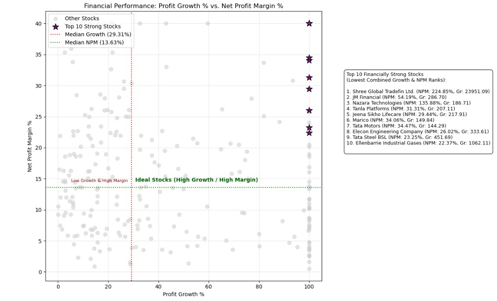
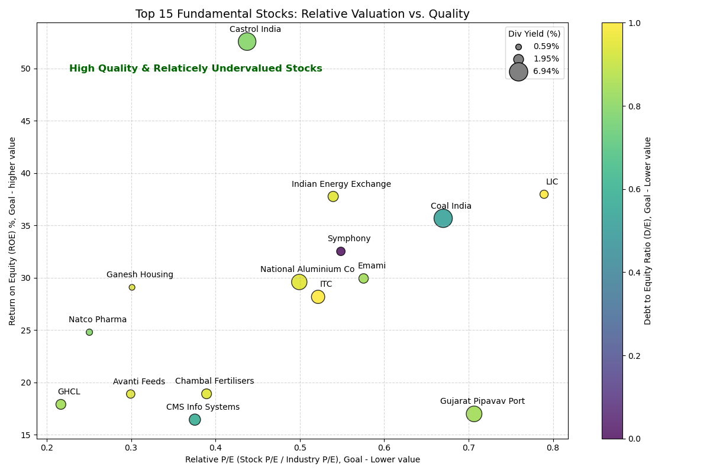

# Mid & Large-Cap Stock Analysis (Python EDA)

### Project Objective
The goal of this project is to provide a clear, data-driven window into the Indian stock market by analyzing a specific segment: **Mid-cap and Large-cap stocks priced under 1000 INR**. By leveraging web scraping and exploratory data analysis, I aim to uncover the relationship between market capitalization and price stability.

### Problem Statement
Investors often find it challenging to filter through thousands of stocks to find high-quality companies within a specific budget. This project solves that by answering:
1. Which sectors dominate the under-1000 price bracket for Large and Mid-cap companies?
2. How does Market Cap influence the volatility of these stocks?
3. Rank companies based on their ability to consistently grow sales and profit, revealing the fastest-moving, high-momentum performers.
4. Mitigate risk by filtering for companies with low debt and identify those that provide reliable passive dividend income.
5. Turn complicated financial data into clear, visual charts that provide simple, ready-to-use advice for long-term investment decisions.

### 🛠 Tech Stack
* **Language:** Python (Jupyter Notebook)
* **Web Scraping:** `Requests` & `BeautifulSoup` (Scraping live data from Groww.in)
* **Data Manipulation:** `Pandas` & `NumPy`
* **Visualization:** `Matplotlib` & `Seaborn`

---

### Financial & Fundamental Data Preview
Below are the final datasets extracted, showing the fundamental health and financial standing of the top 15 stocks within the 0-1000 INR range.

| Top 15 Financial Strong Stocks | Top 15 Fundamental Performing Stocks |
| :---: | :---: |
|  |  |

---

### Technical Deep Dive

#### 1. Targeted Web Scraping
I utilized the `Requests` library to scrape data directly from Groww’s filtered screener. The scraping logic specifically targeted:
* **Price Range:** 0 - 1000 INR.
* **Market Cap:** Mid-cap (5,000Cr+) to Large-cap (up to 3,000,000Cr+).
* **Pagination:** Handled dynamic URL parameters to ensure a robust sample size for the EDA.

#### 2. Exploratory Data Analysis (EDA)
Using **Seaborn** and **Matplotlib**, I analyzed:
* **Sectoral Strength:** Identifying which industries provide the most options within this budget.
* **Volatility Analysis:** Correlating current market prices with 52-week highs and lows to identify stocks trading at a discount.
* **Market Cap Distribution:** Visualizing the concentration of wealth across the scraped companies.

### How to Run
1. Clone this repository.
2. Install dependencies: `pip install pandas matplotlib seaborn requests`.
3. Open `Stock_Analysis.ipynb` in Jupyter Notebook or VS Code to see the live scraping and visualization process.

---
